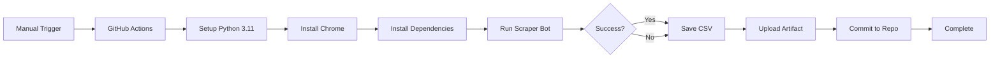

<div align="center">

# 🤖 LinkedIn Scraper Bot

### *Intelligent Web Scraping Solution with Cloud Automation*

[](https://www.python.org/)
[](https://www.selenium.dev/)
[](https://github.com/features/actions)
[](LICENSE)
[]()

*A professional-grade web scraping solution that automates LinkedIn profile data collection using Selenium WebDriver and GitHub Actions CI/CD pipeline.*

[Features](#-features) • [Demo](#-demo) • [Installation](#-installation) • [Usage](#-usage) • [Documentation](#-documentation)

---

</div>

## 📋 Overview

This project demonstrates advanced web scraping techniques combined with modern DevOps practices. Built with Python and Selenium, it intelligently extracts LinkedIn profile data from Google search results while implementing anti-detection measures and running autonomously in the cloud.

**Perfect for:**
- 🎯 Recruitment & HR professionals seeking candidate data
- 📊 Market researchers analyzing professional demographics
- 🔍 Lead generation and business development
- 💼 Career coaches building industry insights
- 🚀 Developers learning automation & web scraping

---

## ✨ Features

### Core Functionality
- 🔍 **Intelligent Search** - Automated Google search with customizable queries
- 🎭 **Anti-Detection** - Randomized user agents, delays, and stealth mode
- 📊 **Data Export** - Clean CSV output with timestamps
- 🔄 **Fresh Data** - Each run fetches new results, not cached data
- ⚡ **Efficient Scraping** - Optimized selectors and error handling

### Cloud & DevOps
- ☁️ **GitHub Actions Integration** - Serverless execution in the cloud
- 🔄 **Manual Trigger** - On-demand workflow execution
- 📦 **Artifact Storage** - Automatic result archiving (30 days)
- 🐳 **Docker Support** - Containerized for easy deployment
- 🔒 **Secure** - No credentials stored, environment-based configuration

### Professional Features
- 📝 **Unique File Naming** - Timestamped files for each run
- 🎯 **Customizable Queries** - Search any LinkedIn profile type
- 🛡️ **Error Recovery** - Graceful handling of failures
- 📈 **Scalable Architecture** - Easy to extend and modify
- 🔧 **Production Ready** - Robust error handling and logging

---

## 🎬 Demo

### Workflow Interface
```
Actions → LinkedIn Scraper Bot → Run workflow
├── 🔍 Custom Search Query: "site:linkedin.com/in/ data scientist"
├── ⏰ Use Timestamp: true/false
└── ▶️ Run workflow
```

### Output Preview
```csv
title,link,scraped_at
"John Doe - Senior Software Engineer",https://linkedin.com/in/johndoe,2026-01-19T14:30:25
"Jane Smith - Data Scientist at Google",https://linkedin.com/in/janesmith,2026-01-19T14:30:27
"Michael Johnson - Full Stack Developer",https://linkedin.com/in/michaelj,2026-01-19T14:30:29
```

---

## 📁 Project Architecture

```
linkedin-scraper-bot/
├── 🐍 bot.py                      # Main scraper with anti-detection
├── 📦 requirements.txt            # Python dependencies
├── 🐳 Dockerfile                  # Container configuration
├── 🔧 runtime.txt                 # Python version specification
├── 📄 README.md                   # This file
├── 🚫 .gitignore                  # Git ignore rules
└── 📂 .github/
    └── workflows/
        └── ⚙️ scraper.yml         # GitHub Actions workflow
```

---

## 🚀 Installation

### Prerequisites
- Python 3.11+
- Google Chrome or Chromium
- Git

### Local Setup

1. **Clone the repository**
   ```bash
   git clone https://github.com/EHTISHAM-AI-ENTHUSIAST/linkedin-scraper-bot.git
   cd linkedin-scraper-bot
   ```

2. **Install dependencies**
   ```bash
   pip install -r requirements.txt
   ```

3. **Run the bot**
   ```bash
   # Default search query
   python bot.py
   
   # Custom search query
   set SEARCH_QUERY=site:linkedin.com/in/ python developer
   python bot.py
   
   # With visible browser (for debugging)
   set HEADLESS=false
   python bot.py
   ```

### Docker Deployment

```bash
# Build the image
docker build -t linkedin-scraper .

# Run the container
docker run -e SEARCH_QUERY="site:linkedin.com/in/ AI engineer" linkedin-scraper
```

---

## 🎯 Usage

### GitHub Actions (Recommended)

1. **Navigate to Actions**
   - Go to your repository on GitHub
   - Click the **Actions** tab
   - Select **LinkedIn Scraper Bot** workflow

2. **Run Workflow**
   - Click **Run workflow** button
   - **Search Query**: Enter your custom search (e.g., `site:linkedin.com/in/ UX designer`)
   - **Use Timestamp**: Choose `true` for unique files, `false` for overwriting
   - Click **Run workflow**

3. **Download Results**
   - Wait for workflow to complete (~2-5 minutes)
   - Scroll down to **Artifacts** section
   - Download `linkedin-profiles-{run_number}.zip`
   - Extract and open CSV file

### Command Line

```bash
# Set environment variables
export SEARCH_QUERY="site:linkedin.com/in/ machine learning engineer"
export HEADLESS=true
export USE_TIMESTAMP=true

# Run the scraper
python bot.py
```

---

## ⚙️ Configuration

### Environment Variables

| Variable | Default | Description |
|----------|---------|-------------|
| `SEARCH_QUERY` | `site:linkedin.com/in/ software engineer` | Google search query string |
| `HEADLESS` | `true` | Run browser without GUI (`true`/`false`) |
| `USE_TIMESTAMP` | `false` | Add timestamp to filename (`true`/`false`) |
| `OUTPUT_FILE` | `linkedin_profiles.csv` | Output filename |
| `MAX_RESULTS` | `30` | Maximum profiles to scrape |
| `CHROME_BIN` | Auto-detect | Chrome binary path (for GitHub Actions) |

### Custom Search Examples

```bash
# Find Python developers
SEARCH_QUERY="site:linkedin.com/in/ python developer"

# Find people at specific company
SEARCH_QUERY="site:linkedin.com/in/ Google software engineer"

# Find by location
SEARCH_QUERY="site:linkedin.com/in/ designer San Francisco"

# Find by title and skills
SEARCH_QUERY="site:linkedin.com/in/ DevOps AWS kubernetes"
```

---

## 🛠️ Technical Stack

<div align="center">

| Technology | Purpose |
|------------|---------|
| **Python 3.11** | Core programming language |
| **Selenium WebDriver** | Browser automation & scraping |
| **Chrome/Chromium** | Headless browser engine |
| **GitHub Actions** | CI/CD & cloud execution |
| **Docker** | Containerization |
| **CSV** | Data export format |

</div>

---

## 📊 Workflow Architecture



---

## 🔐 Security & Best Practices

- ✅ **No credentials required** - Uses public Google search
- ✅ **Rate limiting** - Built-in delays to avoid detection
- ✅ **Error handling** - Graceful failures, no data corruption
- ✅ **Anti-detection** - Randomized user agents & human-like behavior
- ✅ **GitHub secrets ready** - Easy integration with private APIs
- ✅ **GDPR compliant** - Public data only

---

## 📈 Roadmap & Future Enhancements

- [ ] 🔄 Proxy rotation support
- [ ] 📧 Email notifications on completion
- [ ] 💾 Database integration (PostgreSQL/MongoDB)
- [ ] 🌐 REST API wrapper
- [ ] 📱 Mobile app integration
- [ ] 🤖 AI-powered profile analysis
- [ ] 📊 Dashboard & analytics

---

## 🤝 Contributing

Contributions are welcome! Please feel free to submit a Pull Request. For major changes, please open an issue first to discuss what you would like to change.

1. Fork the repository
2. Create your feature branch (`git checkout -b feature/AmazingFeature`)
3. Commit your changes (`git commit -m 'Add some AmazingFeature'`)
4. Push to the branch (`git push origin feature/AmazingFeature`)
5. Open a Pull Request

---

## 📝 License

This project is licensed under the MIT License - see the [LICENSE](LICENSE) file for details.

---

## 🙋‍♂️ Support & Contact

<div align="center">

**Need help or want to hire me for a project?**

[](https://github.com/EHTISHAM-AI-ENTHUSIAST)
[](mailto:your.email@example.com)
[](https://linkedin.com/in/yourprofile)

</div>

---

## 💼 Professional Services

I offer professional web scraping and automation services:

- 🎯 **Custom Scraper Development** - Tailored solutions for your needs
- ☁️ **Cloud Automation** - GitHub Actions, AWS Lambda, Azure Functions
- 🔄 **Data Pipeline Development** - ETL processes and integrations
- 🤖 **Bot Development** - Telegram, Discord, WhatsApp bots
- 📊 **Data Analysis** - Python, Pandas, visualization

**Available for freelance projects and consulting.**

---

## ⭐ Show Your Support

If this project helped you, please consider giving it a ⭐️ on GitHub!

---

<div align="center">

**Built with ❤️ by [EHTISHAM-AI-ENTHUSIAST](https://github.com/EHTISHAM-AI-ENTHUSIAST)**

*Specializing in Web Scraping, Automation, and AI Solutions*

---


</div>
